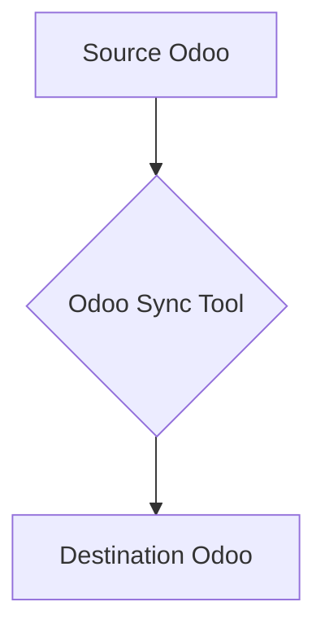

# أداة مزامنة Odoo (Odoo Sync Tool)

## الوصف العام للمشروع

تهدف هذه الأداة إلى توفير حل قوي وموثوق لمزامنة البيانات بين نسختين من نظام Odoo (عادةً من نظام Odoo Community كمصدر إلى نظام Odoo Online كوجهة). تركز الأداة على ضمان تحديثات تدريجية، والتعامل الذكي مع تعديلات المستندات المرحّلة، والحفاظ على سلامة البيانات، مع توفير نظام تسجيل واضح وبنية ملفات قابلة للصيانة.

## تدفق البيانات



## الميزات الرئيسية

*   **مزامنة تدريجية (Incremental Sync):** تقوم الأداة بمزامنة السجلات التي تم تعديلها فقط منذ آخر عملية مزامنة ناجحة، وذلك باستخدام حقل `write_date` لتحديد التغييرات.
*   **تحديد السجلات الفريدة:** تعتمد المزامنة على حقول `x_MODEL_sync_id` المخصصة (مثل `x_partner_sync_id`, `x_move_sync_id`) في نظام Odoo الوجهة لتحديد السجلات بشكل فريد وربطها بسجلاتها الأصلية في المصدر.
*   **معالجة المستندات المرحّلة (Posted Documents):** تتعامل الأداة بذكاء مع تحديث المستندات المحاسبية المرحّلة (مثل الفواتير وقيود اليومية) في Odoo الوجهة من خلال تسلسل "إلغاء الترحيل - التحديث - إعادة الترحيل" (`button_draft()`, `write()`, `action_post()`).
*   **حقول التدقيق (Audit Fields):** يتم إنشاء حقلين مخصصين (`x_original_source_id` و `x_original_write_date`) على نموذج `account.move` في الوجهة لتخزين المعرف الأصلي وتاريخ آخر تعديل من المصدر، مما يسهل تتبع البيانات.
*   **التعامل مع التوقيتات (UTC):** يتم التعامل مع جميع الطوابع الزمنية للمزامنة بتوقيت UTC لتجنب مشاكل فروق التوقيت وضمان دقة اكتشاف التغييرات.
*   **المزامنة الدفعية (Batch Processing):** تم تحسين أداء المزامنة من خلال تحديث السجلات وإنشائها على دفعات بدلاً من معالجة كل سجل على حدة.
*   **معالجة الحذف (Deletion Handling):** تقوم الأداة بأرشفة (soft delete) السجلات في نظام الوجهة إذا تم حذفها من نظام المصدر، بدلاً من حذفها بشكل دائم.
*   **إدارة مفاتيح المزامنة:** يتم استخدام قاعدة بيانات `sync_map.db` محلية (تدار بواسطة `SyncKeyManager`) لتخزين خرائط الربط بين معرفات المصدر والوجهة، وهو أمر حيوي للبحث عن السجلات المرتبطة.
*   **نظام تسجيل شامل (Comprehensive Logging):** يتم توجيه رسائل السجل إلى ملفات منفصلة لـ:
    *   `error.log`: للأخطاء الحرجة.
    *   `activity.log`: للنشاط العام وعمليات المزامنة.
    *   `sync.log`: لتفاصيل عمليات المزامنة الدقيقة.
    *   بالإضافة إلى عرض رسائل `INFO` وما فوق في الطرفية.
*   **بنية ملفات منظمة:** تم إعادة هيكلة المشروع إلى مجلدات `core/`, `services/`, و `sync/modules/` لتحسين قابلية الصيانة والتوسع.

## بنية المشروع

```
.
├── .gitignore
├── config.ini                 # ملف إعدادات الاتصال بـ Odoo
├── last_sync_time.txt         # لتخزين آخر وقت مزامنة ناجح
├── main.py                    # نقطة الدخول الرئيسية للتطبيق
├── README.md                  # هذا الملف
├── requirements.txt           # قائمة بجميع تبعيات المشروع
├── setup.py                   # ملف إعداد المشروع (للتثبيت)
├── sync_map.db                # قاعدة بيانات SQLite لخرائط الربط
├── core/
│   └── sync_engine.py         # النواة الرئيسية للمزامنة، تدير الوحدات والعملية
├── modules/                   # (مجلد قديم، تم نقل محتوياته إلى sync/modules/)
├── odoorpc/                   # مكتبة odoorpc (مكتبة خارجية)
├── services/
│   ├── config_manager.py      # لإدارة قراءة إعدادات config.ini
│   ├── logger_config.py       # لإعداد نظام التسجيل
│   ├── odoo_connector.py      # لإدارة الاتصال بـ Odoo وإنشاء الحقول المخصصة
│   └── sync_key_manager.py    # لإدارة خرائط الربط بين معرفات المصدر والوجهة
├── sync/
│   └── modules/               # وحدات المزامنة المتخصصة لكل نموذج Odoo
│       ├── accounts_sync.py   # مزامنة شجرة الحسابات (account.account)
│       ├── company_sync.py    # مزامنة الشركات (res.company)
│       ├── contacts_sync.py   # مزامنة جهات الاتصال (res.partner)
│       ├── invoices_sync.py   # مزامنة الفواتير (account.move)
│       ├── journal_entries_sync.py # مزامنة قيود اليومية (account.move - entry)
│       ├── journals_sync.py   # مزامنة دفاتر اليومية (account.journal)
│       └── taxes_sync.py      # مزامنة الضرائب (account.tax)
└── venv/                      # البيئة الافتراضية لـ Python
```

## الإعداد والتشغيل

### المتطلبات الأساسية

*   Python 3.x
*   pip (مدير حزم بايثون)
*   ملف `config.ini` معد بشكل صحيح (انظر قسم الإعدادات).

### التثبيت

1.  **استنساخ المستودع (إذا كان متاحًا):**
    ```bash
    git clone <رابط المستودع>
    cd <اسم مجلد المشروع>
    ```
2.  **إنشاء بيئة افتراضية وتفعيلها:**
    ```bash
    python -m venv venv
    # على Windows:
    .\venv\Scripts\activate
    # على macOS/Linux:
    source venv/bin/activate
    ```
3.  **تثبيت التبعيات:**
    ```bash
    pip install -r requirements.txt
    ```

### الإعدادات (config.ini)

يجب إنشاء ملف `config.ini` في الجذر الرئيسي للمشروع (بجانب `main.py`) يحتوي على بيانات اعتماد الاتصال بنظامي Odoo المصدر والوجهة. مثال:

```ini
[COMMUNITY_ODOO]
url = http://localhost:8069
db = odoo_community_db
username = admin
password = admin

[ONLINE_ODOO]
url = https://your-online-instance.odoo.com
db = your_online_db
username = admin
password = your_online_password
```

**ملاحظات هامة:**
*   تأكد من صحة `url`, `db`, `username`, و `password` لكل من نظامي Odoo.
*   لأسباب أمنية، لا تقم برفع ملف `config.ini` إلى مستودعات Git العامة.

### التشغيل

لبدء عملية المزامنة، قم بتشغيل ملف `main.py` من الطرفية بعد تفعيل البيئة الافتراضية:

```bash
python main.py
```

ستقوم الأداة تلقائيًا بتهيئة الاتصالات، التحقق من الحقول المخصصة، ثم بدء تشغيل وحدات المزامنة بالترتيب المحدد.

## نظام التسجيل (Logging)

تستخدم الأداة نظام تسجيل مفصل لتتبع العمليات والأخطاء. يتم حفظ السجلات في مجلد `logs/` داخل جذر المشروع:

*   `error.log`: يسجل جميع الأخطاء الحرجة التي تتطلب الانتباه.
*   `activity.log`: يسجل النشاط العام لعملية المزامنة، مثل بدء وانتهاء الوحدات.
*   `sync.log`: يسجل تفاصيل دقيقة لكل عملية مزامنة سجل، وهو مفيد جدًا لأغراض التصحيح.

بالإضافة إلى ذلك، يتم عرض رسائل `INFO` وما فوق في الطرفية أثناء التشغيل.

## معالجة الحذف

تتبع الأداة نهج "الأرشفة الناعمة" (Soft Deletion) عند التعامل مع السجلات المحذوفة من المصدر. بدلاً من حذف السجلات المقابلة في الوجهة بشكل دائم، تقوم الأداة بتعيين حقل `active` الخاص بها إلى `False`. هذا يحافظ على سلامة البيانات التاريخية في الوجهة ويمنع فقدان البيانات بشكل غير مقصود.

## الاختبارات التلقائية (Unit Tests)

لضمان جودة الكود واستقراره، تم تطوير اختبارات وحدة شاملة باستخدام `pytest` للوحدات الرئيسية في المشروع:

*   **`SyncKeyManager`:**
    *   تختبر إضافة، تحديث، جلب، وإزالة خرائط الربط في قاعدة بيانات SQLite.
    *   تضمن التعامل الصحيح مع السيناريوهات المختلفة مثل جلب المعرفات غير الموجودة.

*   **`ConfigManager`:**
    *   تختبر قراءة بيانات الاعتماد من ملف `config.ini`.
    *   تتحقق من التعامل الصحيح مع الأقسام والمفاتيح المفقودة.

*   **`OdooConnector`:**
    *   تستخدم `pytest-mock` لمحاكاة مكتبة `odoorpc` لتجنب الاتصال الفعلي بخادم Odoo أثناء الاختبارات.
    *   تختبر وظائف الاتصال، وإعادة الاتصال، والتأكد من وجود الحقول المخصصة (`ensure_custom_field`).

### تشغيل الاختبارات

لتشغيل جميع اختبارات الوحدة، تأكد من تفعيل بيئتك الافتراضية ثم نفذ الأمر التالي في الطرفية:

```bash
pytest tests/
```

## التحسينات المستقبلية (TODOs)

*   **تحسين معالجة الأخطاء:** إضافة آليات أكثر تفصيلاً لإعادة المحاولة (retry mechanisms) للعمليات الفاشلة.
*   **دعم نماذج إضافية:** توسيع الأداة لدعم مزامنة نماذج Odoo إضافية حسب الحاجة.
*   **واجهة مستخدم (اختياري):** تطوير واجهة مستخدم رسومية (GUI) لتسهيل إدارة عملية المزامنة.
*   **تحسين الأداء:** استكشاف المزيد من طرق تحسين الأداء للتعامل مع كميات كبيرة جدًا من البيانات.

---